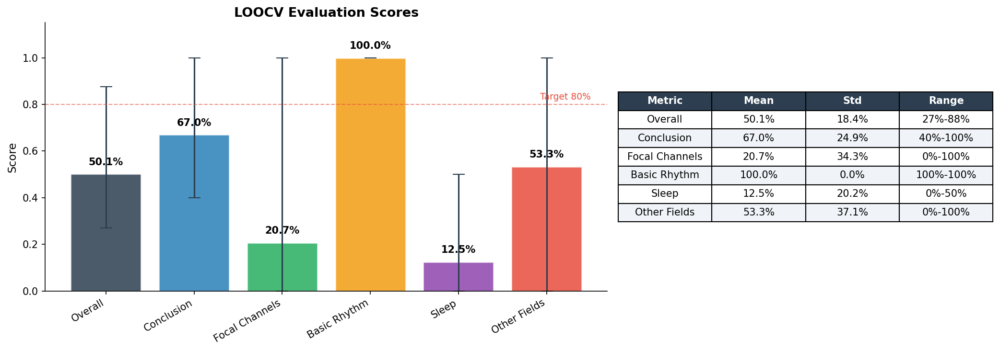
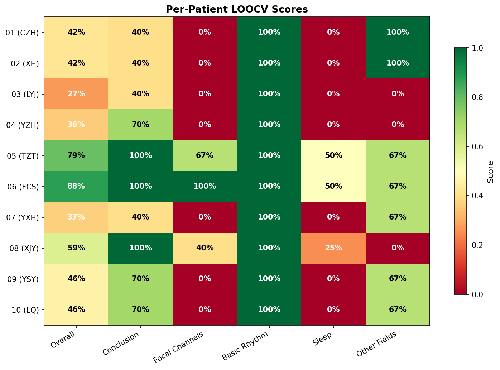

<div align="center">

# NeuroDetect.ai
**Pediatric EEG Analysis Platform**

A clinical-grade web interface for automated pediatric epilepsy EEG analysis, powered by a two-stage AI pipeline (signal processing + RAG-based report generation).
</div>

<p align="center">
  
  
  
  
  
  <a href="https://supergokou.github.io/deepseek_epilepsy_detect/">
    
  </a>
</p>


## Table of Contents

- [Overview](#overview)
- [AI Pipeline Behind the Platform](#ai-pipeline-behind-the-platform)
- [Evaluation Results](#evaluation-results)
- [Application Pages](#application-pages)
- [Tech Stack](#tech-stack)
- [Project Structure](#project-structure)
- [Getting Started](#getting-started)
- [Deployment](#deployment)
- [Roadmap](#roadmap)
- [Contributing](#contributing)
- [License & Disclaimer](#license--disclaimer)

---

## Overview

**NeuroDetect.ai** is a research-oriented web application that assists pediatric neurologists in interpreting long-duration EEG recordings. Clinicians upload raw NumPy (`.npy`) EEG files, and the system automatically:

1. **Extracts clinical features** -- posterior dominant rhythm, spike/sharp-wave detection, sleep staging, and spatial localization across 19 channels (International 10-20 System).
2. **Generates structured Chinese-language EEG reports** -- using Retrieval-Augmented Generation (RAG) with a local LLM (Qwen 2.5 32B) and a ChromaDB knowledge base of expert-annotated reports.

The web frontend provides six dedicated views for the complete clinical workflow: uploading data, reviewing AI-generated reports with interactive waveform visualizations, browsing analysis history, and configuring detection parameters.

---

## AI Pipeline Behind the Platform

The backend pipeline processes raw EEG data through two stages before results are displayed in the web interface.

### Stage 1: EEG Feature Extraction (Signal Processing)

No model training required -- this stage uses classical signal processing and rule-based detection.

| Module | What It Computes | Key Methods |
|--------|-----------------|-------------|
| **Spectral Analysis** | Posterior Dominant Rhythm (PDR), band power ratios (delta/theta/alpha/beta/gamma) | Welch PSD estimation, peak detection in 8-13 Hz alpha band |
| **Spike Detection** | Spike counts, focal channel localization, spike-wave complex identification | Amplitude thresholding (5.5 SD), duration filtering (20-200ms), morphology classification |
| **Sleep Staging** | Wake/NREM/REM epoch classification, sleep architecture statistics | 30-second epoch analysis, delta/theta ratio scoring |
| **Spatial Mapping** | Hemispheric asymmetry, focal vs. generalized patterns | Cross-channel coherence, hemispheric power comparison across 8 channel pairs |

**Recording specifications:**
- 19 channels, 1000 Hz sampling rate, 8-12 hour overnight recordings
- Preprocessing: 0.5-70 Hz bandpass filter, 50 Hz notch filter (China power grid)

### Stage 2: Report Generation (RAG + LLM)

| Step | Description |
|------|-------------|
| **Knowledge Base** | 10 expert-annotated clinical EEG reports parsed from `.doc` files, embedded with BGE-M3 into ChromaDB |
| **Retrieval** | For each new patient, the 3 most similar cases are retrieved (excluding the target patient in LOOCV) |
| **Generation** | Qwen 2.5 32B (via Ollama) generates an 11-field structured Chinese EEG report, guided by retrieved reference cases and extracted features |
| **Output** | Structured `.docx` report with comparison against ground truth |

**Report fields (11 total):** Basic wave rhythm, awake recording, eye open/close test, photic stimulation, hyperventilation test, natural sleep recording, clinical seizure during recording, ictal EEG, clinical seizure description, conclusion.

---

## Evaluation Results

The pipeline is evaluated using **Leave-One-Out Cross-Validation (LOOCV)** across 10 pediatric patients. Each patient's report is generated using only the remaining 9 as reference cases.

### Aggregate LOOCV Scores



| Metric | Mean | Std | Range |
|--------|------|-----|-------|
| **Overall** | 50.1% | 18.4% | 27% - 88% |
| **Conclusion** | 67.0% | 24.9% | 40% - 100% |
| **Focal Channels** | 20.7% | 34.3% | 0% - 100% |
| **Basic Rhythm** | 100.0% | 0.0% | 100% - 100% |
| **Sleep** | 12.5% | 20.2% | 0% - 50% |
| **Other Fields** | 53.3% | 37.1% | 0% - 100% |

**Key findings:**
- **Basic Rhythm** achieves perfect accuracy (100%) -- the spectral analysis reliably identifies posterior dominant rhythm characteristics.
- **Conclusion** performs well at 67% mean, with 4 out of 10 patients reaching 100% accuracy.
- **Focal Channels** (20.7%) and **Sleep** (12.5%) are the weakest areas, reflecting the difficulty of precise spatial localization and sleep-stage-dependent feature detection with rule-based methods alone.

### Per-Patient Breakdown



Best-performing patients: **Patient 06 (FCS)** at 88% overall and **Patient 05 (TZT)** at 79% overall -- both have clear focal patterns that the rule-based detector handles well.

Lowest-performing patients: **Patient 03 (LYJ)** at 27% -- a generalized 3 Hz spike-wave case that is particularly challenging for the current spatial detection algorithm.

---

## Application Pages

The web interface consists of six views, accessible from the top navigation bar.

### 1. Dashboard

The landing page provides a quick overview of recent uploads and their processing status. Clinicians can start a new analysis directly or jump to any recent report.

- Hero section with quick-start actions
- Recent uploads table with status badges (Processed / Pending)
- Result summaries with visual indicators (Normal / Potential Activity)

### 2. Upload (New Analysis)

Drag-and-drop file upload interface with real-time validation and progress tracking.

- Accepts `.npy` files up to 500 MB
- Animated upload progress bar with stage indicators
- File format validation and clear error messaging
- Automatic transition to report view upon completion

### 3. Analysis Report

The core clinical view displaying AI analysis results with interactive visualizations.

- **Detection status card** -- color-coded alert (green for normal, amber for potential epileptiform activity)
- **Confidence score** -- model accuracy estimate with visual progress bar
- **Recording metrics** -- duration, channel count, detected event count
- **Interactive waveform chart** -- EEG signal visualization built with Recharts, with highlighted anomaly regions (amber shading) for detected epileptiform discharges
- Contextual notes identifying specific time intervals for clinical review

### 4. History

Searchable, filterable archive of all past analyses.

- Full-text search by filename or patient ID
- Status filter (All / Normal / Abnormal / Pending)
- Sortable table with file details, duration, status, and confidence
- CSV export capability
- Pagination for large datasets

### 5. Protocol & Methodology

Technical documentation page explaining the analysis pipeline to clinicians.

- Step-by-step protocol: data requirements, AI processing pipeline, interpretation guidelines
- Data input specifications (array shapes, supported montages)
- Three-phase pipeline diagram: Preprocessing, Feature Extraction, Classification
- Medical disclaimer and regulatory status

### 6. Settings

User profile and analysis configuration management.

- Profile information (name, email, license ID, department)
- Detection sensitivity threshold slider (50-99%, default 75%)
- Automatic processing toggle
- Email notification preferences

---

## Tech Stack

| Layer | Technology | Purpose |
|-------|-----------|---------|
| **Framework** | React 19 | Component-based UI with hooks |
| **Language** | TypeScript 5.8 | Type-safe development |
| **Build Tool** | Vite 6 | Fast HMR development server and optimized production builds |
| **Styling** | Tailwind CSS v4 | Utility-first CSS with custom design tokens |
| **Charts** | Recharts 2.15 | EEG waveform visualization with reference areas |
| **Animations** | Motion (Framer Motion) | Page transitions, drag feedback, progress animations |
| **File Upload** | react-dropzone | Drag-and-drop with file type/size validation |
| **Notifications** | Sonner | Toast notifications for analysis status updates |
| **Icons** | Lucide React | Consistent iconography across all views |

---

## Project Structure

```
Wesite/
|-- index.html                    # Vite entry HTML
|-- package.json                  # Dependencies and scripts
|-- tsconfig.json                 # TypeScript configuration
|-- vite.config.ts                # Vite + React + Tailwind v4 config
|-- src/
|   |-- App.tsx                   # Root component with view routing
|   |-- main.tsx                  # ReactDOM entry point
|   |-- vite-env.d.ts             # Vite type declarations
|   |-- components/
|   |   |-- Layout.tsx            # Header, navigation, footer shell
|   |   |-- Dashboard.tsx         # Dashboard with recent uploads
|   |   |-- Upload.tsx            # Drag-and-drop file upload
|   |   |-- Report.tsx            # Analysis report with charts
|   |   |-- WaveformChart.tsx     # Recharts EEG visualization
|   |   |-- History.tsx           # Searchable analysis archive
|   |   |-- Protocol.tsx          # Methodology documentation
|   |   +-- Settings.tsx          # User & analysis configuration
|   +-- styles/
|       +-- globals.css           # Tailwind v4 theme with custom tokens
|-- docs/
|   |-- eval_aggregate.png        # LOOCV aggregate scores chart
|   +-- eval_heatmap.png          # Per-patient scores heatmap
+-- .github/
    +-- workflows/
        +-- deploy.yml            # GitHub Pages CI/CD workflow
```

---

## Getting Started

### Prerequisites

- **Node.js** >= 18 (recommended: 22 LTS)
- **npm** >= 9

### Installation

```bash
cd Wesite
npm install
```

### Development

```bash
npm run dev
```

Opens the development server at `http://localhost:5173` with hot module replacement.

### Production Build

```bash
npm run build
```

Outputs optimized static files to `dist/`.

### Preview Production Build

```bash
npm run preview
```

Serves the `dist/` folder locally for final verification before deployment.

---

## Deployment

### GitHub Pages

1. In `vite.config.ts`, set the `base` field to your repository name:
   ```ts
   base: "/<repo-name>/",
   ```
2. Push to the `main` branch.
3. In your GitHub repository, go to **Settings > Pages > Source** and select **GitHub Actions**.
4. The included `.github/workflows/deploy.yml` workflow will automatically build and deploy on every push to `main`.

### Render (Alternative)

1. Keep `base: "/"` in `vite.config.ts`.
2. Connect your GitHub repository to Render.
3. Configure:
   - **Build Command:** `npm install && npm run build`
   - **Publish Directory:** `dist`

---

## Roadmap

This section outlines planned improvements to both the AI pipeline and the web interface.

### Near-Term (v1.1)

- [ ] **Improve focal channel detection accuracy** -- Replace rule-based spike detector with a trained CNN/Transformer model to improve the current 20.7% accuracy on spatial localization. This is the single highest-impact improvement available.
- [ ] **Improve sleep staging accuracy** -- Integrate a dedicated sleep staging model (e.g., U-Sleep or similar) to improve the 12.5% mean score. Current epoch-based delta/theta ratio is insufficient for pediatric EEG where age-dependent patterns dominate.
- [ ] **Connect frontend to backend API** -- Replace mock/simulated data with real API calls to the Python pipeline. Implement a FastAPI or Flask backend that accepts `.npy` uploads and returns extracted features + generated reports.
- [ ] **Real-time upload progress** -- Replace simulated progress bar with actual upload tracking using `XMLHttpRequest` or `fetch` with `ReadableStream`.
- [ ] **PDF report generation** -- Implement client-side or server-side PDF export for the Analysis Report view.

### Mid-Term (v1.2)

- [ ] **Expand training dataset** -- Scale from 10 to 100+ annotated patient records using the `discover_patients()` auto-discovery function. More reference cases in the RAG knowledge base should directly improve report generation quality.
- [ ] **Multi-channel waveform viewer** -- Replace the single-channel Recharts visualization with a full 19-channel EEG montage viewer (consider using WebGL-based rendering for performance).
- [ ] **User authentication** -- Add login/registration with role-based access (neurologist, technician, researcher).
- [ ] **Internationalization (i18n)** -- Support both Chinese and English report generation and UI language switching.
- [ ] **Dark mode** -- The Tailwind v4 theme already includes dark mode CSS variables. Wire up a theme toggle using the existing design token system.

### Long-Term (v2.0)

- [ ] **End-to-end deep learning model** -- Train a single model that goes directly from raw EEG to structured report, bypassing the two-stage pipeline. Use the current pipeline outputs as training labels.
- [ ] **DICOM / EDF import** -- Support standard clinical EEG file formats (European Data Format, DICOM) in addition to `.npy`.
- [ ] **Real-time streaming analysis** -- Support live EEG streaming from bedside monitors for inpatient epilepsy monitoring units.
- [ ] **Multi-institution deployment** -- HIPAA/GDPR-compliant cloud deployment with federated learning across hospital sites.
- [ ] **Regulatory pathway** -- Prepare documentation for FDA 510(k) De Novo classification as a clinical decision support tool.

---

## Contributing

1. Fork the repository.
2. Create a feature branch: `git checkout -b feature/your-feature`.
3. Make your changes and ensure `npm run build` passes with no errors.
4. Submit a pull request with a clear description of the changes.

---

## License & Disclaimer

This project is released under the **MIT License**.

**Medical Disclaimer:** NeuroDetect.ai is a research tool designed to assist clinical workflows. It is **not** a replacement for professional medical diagnosis. All analysis results must be reviewed and verified by a qualified neurologist. This tool has not been cleared or approved by any regulatory agency for diagnostic use.
